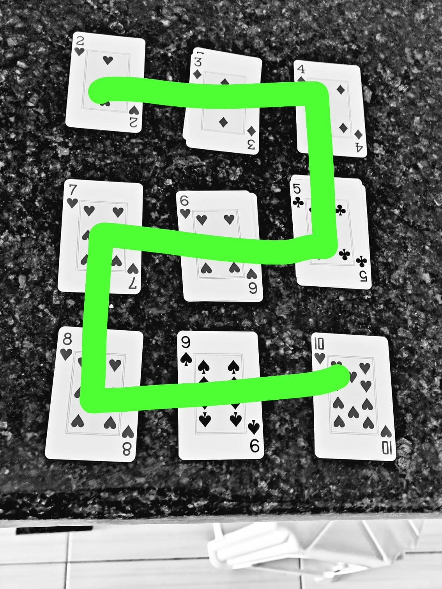
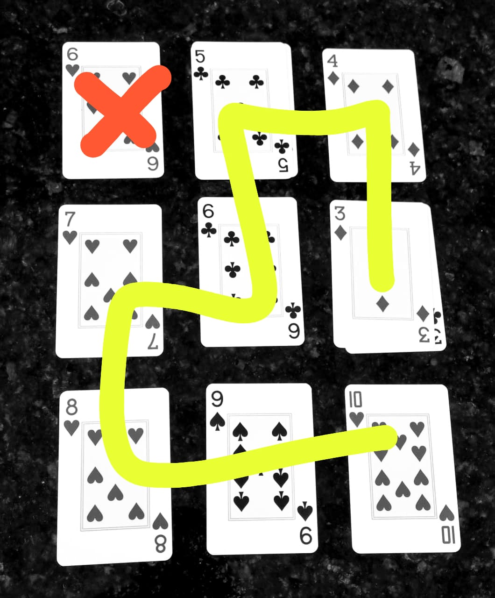

# Solo String Builder 

> By Alan Roger.
> 

# **Objective**

- The objective is to make a string of exactly 9 cards on a 3x3 grid, which is a grid of 9 squares arranged in 3 rows and 3 columns.

# **Important information**

- The suits are not important in this game.
- A string is created when the cards have an orthogonal adjacency on the grid and the difference between them is +1 or -1. The string must be formed using immediately adjacent cards.
- Face cards (A, J, Q, K) may not be used in the string.
- This is an example of a grid that contains a string:
    
    
    
- This is an example of a grid without a String:

    

# **Gameplay**

- The first thing to be done is a 3x3 grid that you will use to discard the cards. It should be done with random placement of cards after shuffle the 52 cards deck.
- The player draws a card from the draw pile on each turn and discards it on any space on the grid to form a pile.
- The game ends when either a string of 9 cards is made or the draw pile is empty.

# **Scoring**

- The player's score is calculated by using the top card of each pile as the reference value and summing the points for each pile.
- For each pile, the player receives +1 point for each card of the reference value and -1 point for each non-reference value card.
- To calculate the total score, the player adds up the points for all 9 piles.

# **Winning the game**

- To win the game, the player must make a string and score more than 0 points.
